# Cross-Asset Neural Model 2.0

Doctoral-grade research framework for cross-asset volatility and risk forecasting with walk-forward validation, probabilistic modeling, statistical significance testing, and formal VaR/ES backtesting.

## What This Repo Now Delivers

- End-to-end reproducible research pipeline (`src/cross_asset_research/pipeline.py`)
- Leakage-free walk-forward evaluation across multiple model classes
- Baseline suite: Naive, HAR-RV, HAR-J, VAR(1), GARCH(1,1)-QML, Probabilistic HAR (Gaussian + Student-t)
- Real-data ingestion path: intraday CSV minute-bars to daily realized features
- Probabilistic LSTM path (auto-fallback if PyTorch unavailable)
- Statistical model comparison: Diebold-Mariano + Holm/BH corrections
- Advanced model comparison: SPA test + approximate Model Confidence Set (MCS)
- Risk validation: VaR/ES diagnostics + Kupiec and Christoffersen tests
- Economic validation: volatility-managed strategy backtests with transaction costs
- Advanced publication-style graph pack (16 figures)
- Structured artifacts: leaderboard, per-asset metrics, DM/SPA/MCS tables, risk tables, economic tables, prediction tables, manifest, summary

## Repository Structure

```text
src/cross_asset_research/
  baselines.py
  config.py
  deep_models.py
  economic_backtest.py
  evaluation.py
  features.py
  pipeline.py
  real_data.py
  reporting.py
  risk_backtests.py
  stats_tests.py
  synthetic_data.py
  walkforward.py

artifacts/doctoral_v4/
  figures/*.png
  tables/*.csv
  summary.md
  manifest.json
```

## Research Design (Doctoral Workflow)

1. Data ingestion supports synthetic regime-switching simulation or real intraday minute-bar CSVs
2. Feature stack with lagged volatility, jump indicators, rolling correlations, rolling betas, spillovers
3. Walk-forward protocol with explicit train/validation/test segmentation
4. Model estimation on each split; strict out-of-sample prediction capture
5. Aggregate evaluation with point + probabilistic metrics
6. Pairwise significance testing against best model
7. Risk calibration via VaR/ES backtests and exceedance diagnostics
8. Automated report generation (tables + graph pack + manifest)

## Reproducibility

### Local

```bash
# from repo root
python3 -m venv .venv
source .venv/bin/activate
pip install -r requirements.txt

# optional deep model support
pip install -r requirements-deep.txt

# run quick doctoral pipeline
PYTHONPATH=src python3 -m cross_asset_research.pipeline --quick --run-name doctoral_v4 --output-dir artifacts

# real-data mode example
PYTHONPATH=src python3 -m cross_asset_research.pipeline \
  --data-source real \
  --intraday-map "btc=/abs/path/btc.csv,eurusd=/abs/path/eurusd.csv,spx=/abs/path/spx.csv" \
  --run-name real_run --output-dir artifacts

# with economic backtest controls
PYTHONPATH=src python3 -m cross_asset_research.pipeline \
  --quick --run-name doctoral_v4 \
  --transaction-cost-bps 5 --target-daily-vol 0.01 --max-leverage 3.0

# tests
pytest -q
```

### One-line CLI

```bash
cross-asset-research --quick --run-name doctoral_v4 --output-dir artifacts
```

## Current Results (Run: `artifacts/doctoral_v4`)

### Aggregate leaderboard

| Model | Aggregate RMSE | Aggregate MAE | Aggregate NLL | Coverage@95% |
|---|---:|---:|---:|---:|
| `har_rv` | 0.001487 | 0.000523 | -4.567685 | 0.968519 |
| `har_j_rv` | 0.001487 | 0.000524 | -4.565466 | 0.968519 |
| `prob_har_gaussian` | 0.001487 | 0.000524 | -4.565466 | 0.968519 |
| `prob_har_student_t` | 0.001487 | 0.000524 | -5.613567 | 0.976852 |
| `garch11_qml` | 0.001494 | 0.000516 | -4.568311 | 0.969444 |
| `var1_cross_asset` | 0.001512 | 0.000521 | -4.506929 | 0.961111 |
| `naive_last_surface` | 0.002043 | 0.000631 | -4.206950 | 0.962963 |
| `prob_lstm_gaussian` | 0.002043 | 0.000631 | -0.690443 | 1.000000 |

### DM significance snapshot (vs best baseline `har_rv`)

| Model | p-value | Holm reject | BH reject |
|---|---:|---:|---:|
| `naive_last_surface` | 0.043100 | False | False |
| `prob_lstm_gaussian` | 0.043100 | False | False |
| `var1_cross_asset` | 0.438700 | False | False |
| `har_j_rv` | 1.000000 | False | False |
| `garch11_qml` | 1.000000 | False | False |
| `prob_har_gaussian` | 1.000000 | False | False |
| `prob_har_student_t` | 1.000000 | False | False |

### SPA + MCS snapshot

- SPA benchmark: `naive_last_surface`
- SPA global p-value: `0.0165` (at least one challenger significantly improves benchmark)
- In-MCS models: `har_j_rv`, `prob_har_gaussian`, `prob_har_student_t`, `har_rv`, `garch11_qml`, `var1_cross_asset`

### Risk calibration snapshot (mean across assets)

| Model | Observed exceedance | Kupiec p-value | Christoffersen p-value |
|---|---:|---:|---:|
| `prob_lstm_gaussian` | 0.000000 | ~0.000000 | 1.000000 |
| `naive_last_surface` | 0.024074 | 0.043685 | 0.519890 |
| `prob_har_student_t` | 0.026852 | 0.080120 | 0.467288 |
| `garch11_qml` | 0.036111 | 0.214300 | 0.468700 |
| `har_rv` | 0.037963 | 0.316659 | 0.526755 |
| `prob_har_gaussian` | 0.037963 | 0.316659 | 0.526755 |
| `var1_cross_asset` | 0.038889 | 0.424398 | 0.390925 |

### Economic backtest snapshot (portfolio net Sharpe)

| Model | Net Sharpe | Ann. Return | Ann. Vol |
|---|---:|---:|---:|
| `var1_cross_asset` | 0.5737 | 0.0622 | 0.1085 |
| `naive_last_surface` | 0.3169 | 0.0724 | 0.2285 |
| `har_rv` | 0.0957 | 0.0103 | 0.1078 |

## Advanced Figure Pack

### Regime and dynamics

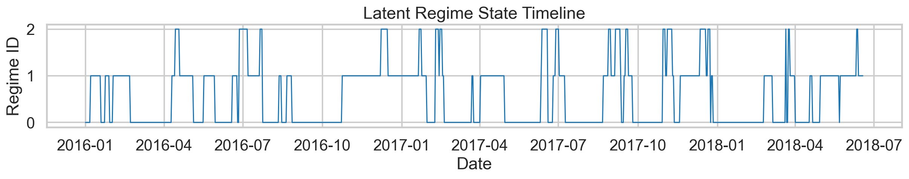
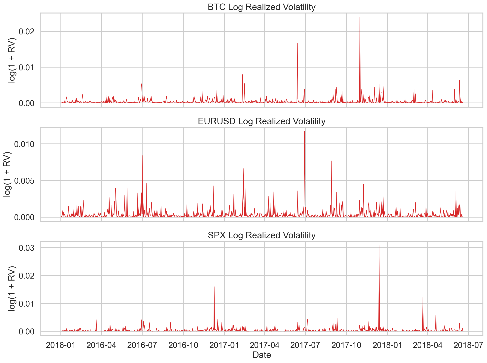
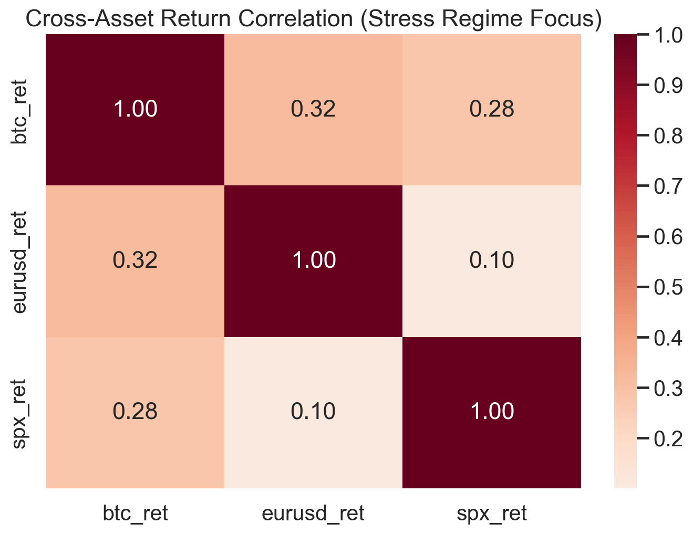
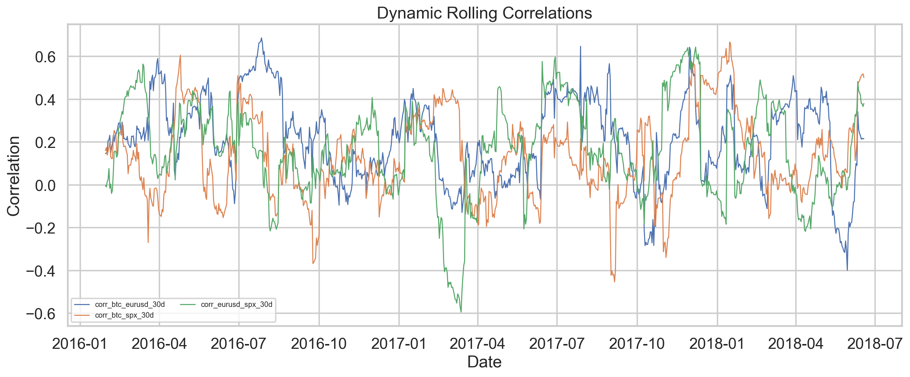

### Model comparison and calibration

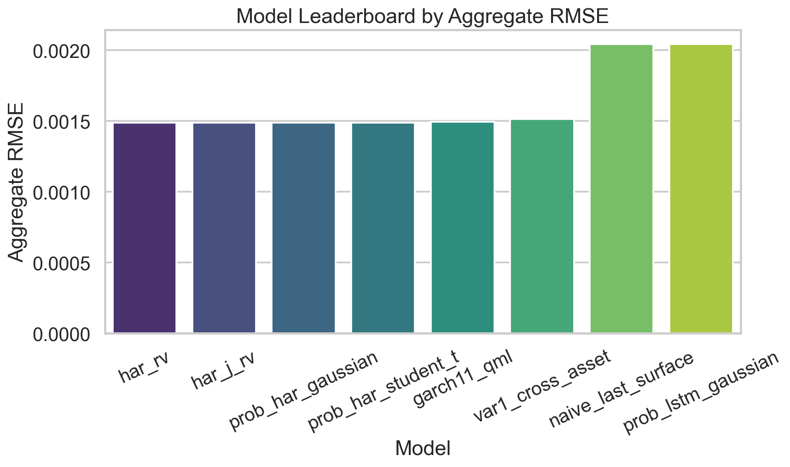
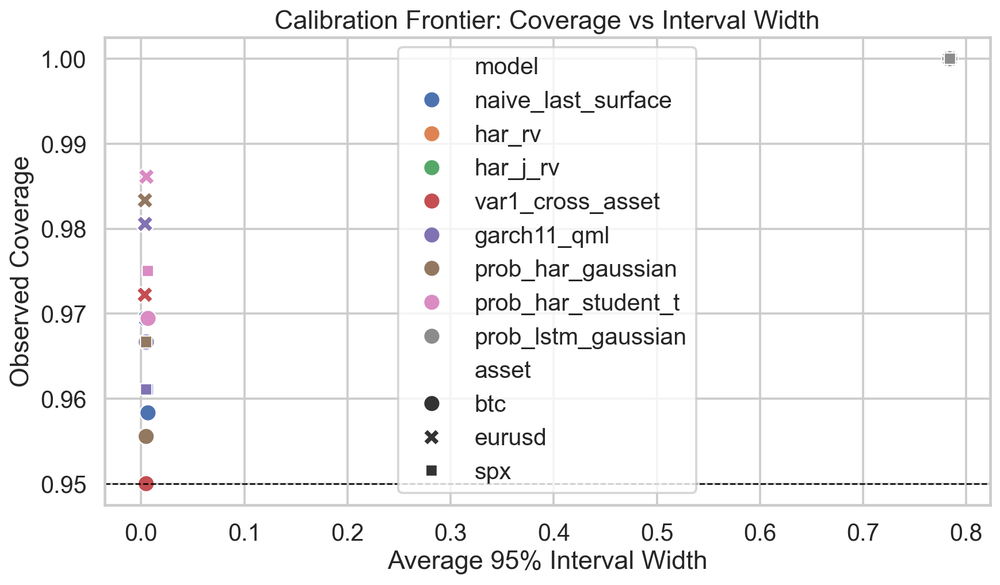
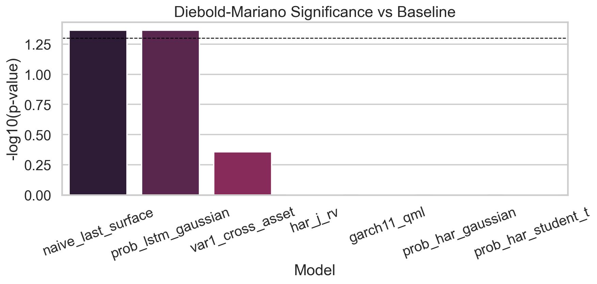
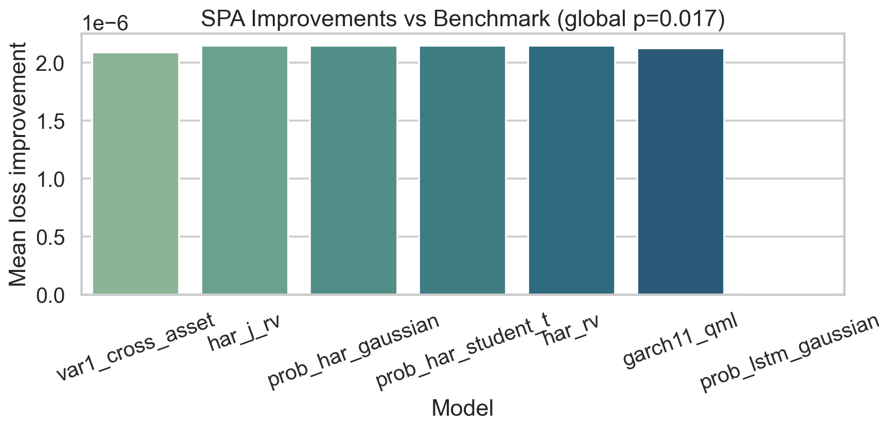
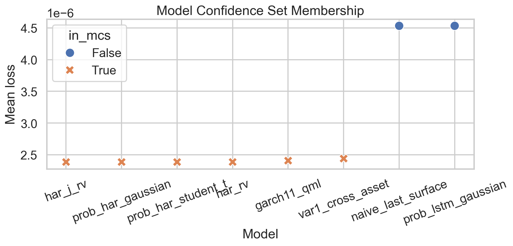
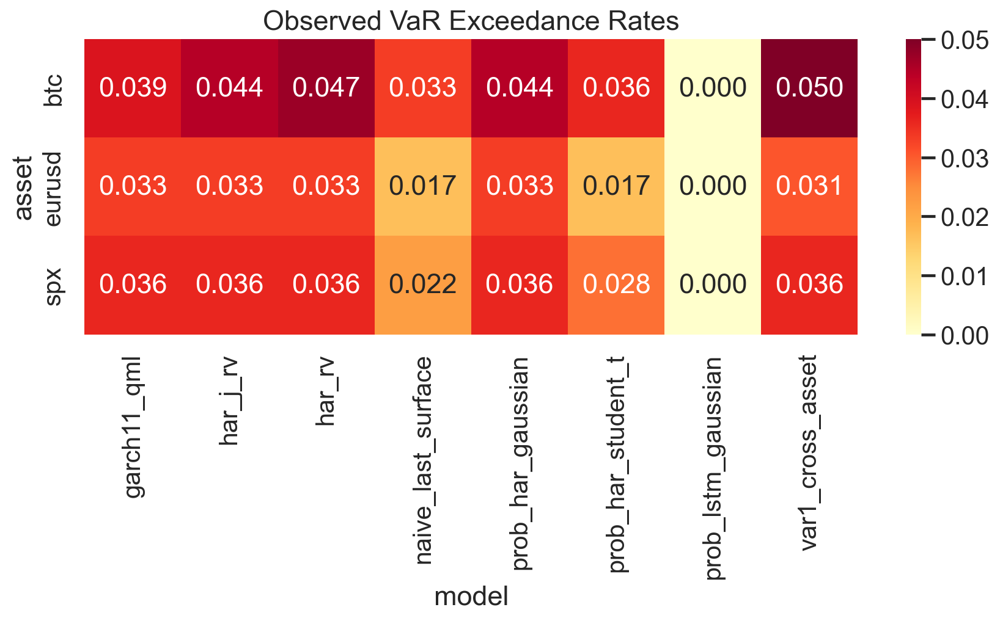
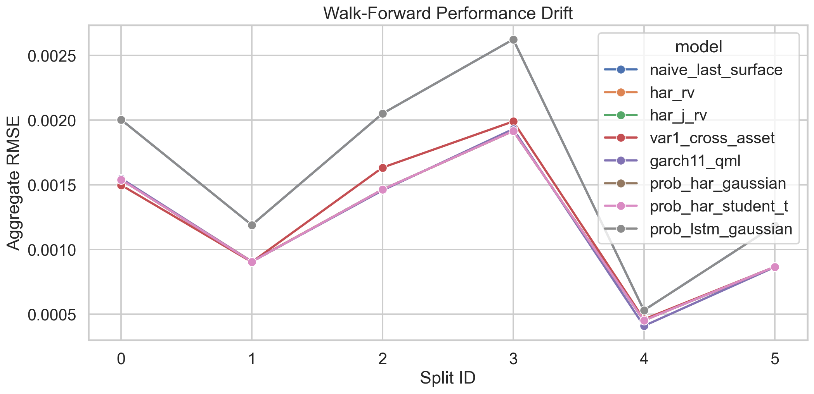

### Forecast distribution diagnostics

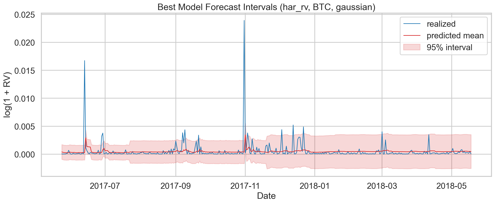
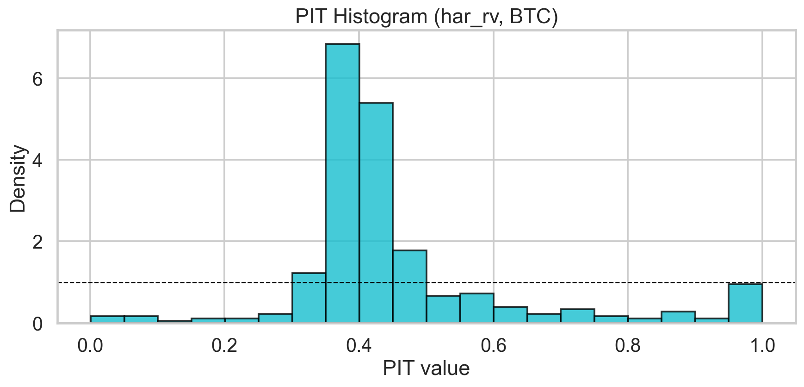
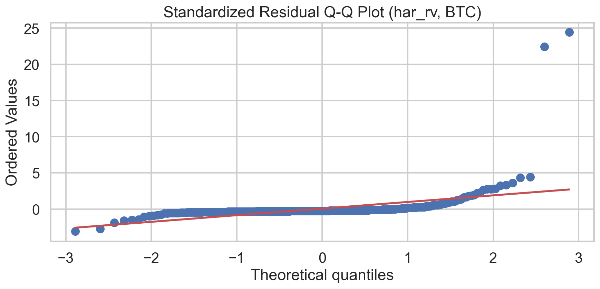
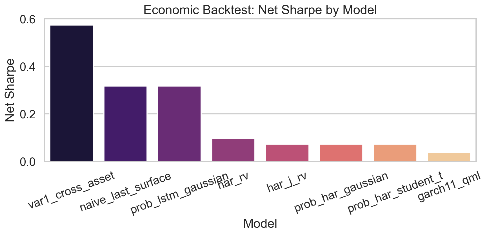
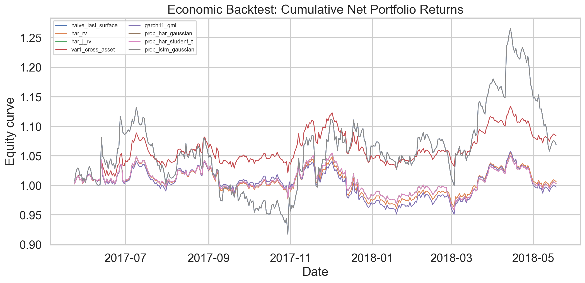

## Artifact Index

- Run summary: `artifacts/doctoral_v4/summary.md`
- Machine-readable manifest: `artifacts/doctoral_v4/manifest.json`
- Tables: `artifacts/doctoral_v4/tables/`
- Prediction exports by model: `artifacts/doctoral_v4/tables/predictions/`

## Testing

- Unit tests for synthetic data, features, walk-forward splits, stats tests, risk backtests
- End-to-end smoke test validates full artifact generation

```bash
pytest -q
```

## Quant Research Positioning

This codebase now demonstrates the full signal-to-deployment research loop expected in top quant research profiles:

- rigorous experimental protocol (walk-forward, out-of-sample only)
- model risk controls (calibration + formal backtests)
- statistical inferential discipline (DM + multiple testing control)
- reproducibility and artifact traceability (manifest + fixed run outputs)
- diagnostics depth (multi-angle figure pack)

## Next Doctoral Extensions (optional)

- Distributional upgrades beyond Student-t (skewed-t, Gaussian mixtures)
- Regime-aware experts / switching neural architectures
- Bayesian uncertainty decomposition (epistemic vs aleatoric)
- Portfolio-level risk translation (volatility forecasts to allocation/risk budgets)
- Live data connectors and scheduled retraining/backtesting
